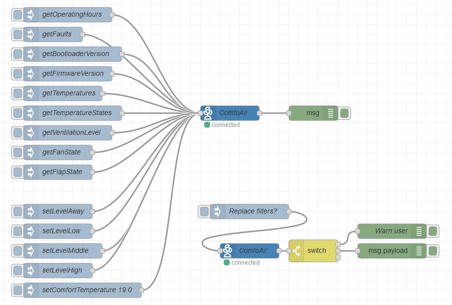

## node-red-contrib-comfoair
[](https://badge.fury.io/js/node-red-contrib-comfoair)
[](https://david-dm.org/coolchip/node-red-contrib-comfoair)
[](https://github.com/coolchip/node-red-contrib-comfoair)

#### Node-RED Node, that reads and parses the data from a Zehnder ComfoAir 350 and similar devices.

This work depends on the comfoair Module ([node-comfoair@github](https://github.com/coolchip/node-comfoair) and [comfoair@npm](https://www.npmjs.com/package/comfoair)).

### Install
Just run
```
    npm install node-red-contrib-comfoair
```

### How to use
Connect to your bus system via serial connection and configure the comfoair node.
Follow the instruction for [streaming with comfoair](https://github.com/coolchip/node-comfoair#as-streaming-object) and pass json objects to this node.

### Example

```text
[{"id":"75939927.987828","type":"inject","z":"f1f45be1.d6959","name":"getTemperatureStates","topic":"","payload":"{\"name\":\"getTemperatureStates\",\"params\":{}}","payloadType":"json","repeat":"","crontab":"","once":false,"onceDelay":0.1,"x":900,"y":1020,"wires":[["54ede071.3b8cf"]]},{"id":"1080bf11.e62391","type":"inject","z":"f1f45be1.d6959","name":"setLevelMiddle","topic":"","payload":"{\"name\":\"setLevel\",\"params\":{\"level\":\"middle\"}}","payloadType":"json","repeat":"","crontab":"","once":false,"onceDelay":0.1,"x":880,"y":1300,"wires":[["54ede071.3b8cf"]]},{"id":"86c0aa8e.73a6d8","type":"inject","z":"f1f45be1.d6959","name":"setLevelAway","topic":"","payload":"{\"name\":\"setLevel\",\"params\":{\"level\":\"away\"}}","payloadType":"json","repeat":"","crontab":"","once":false,"onceDelay":0.1,"x":870,"y":1220,"wires":[["54ede071.3b8cf"]]},{"id":"d89b4127.308c7","type":"debug","z":"f1f45be1.d6959","name":"","active":true,"tosidebar":true,"console":false,"tostatus":false,"complete":"true","targetType":"full","x":1390,"y":1020,"wires":[]},{"id":"54ede071.3b8cf","type":"comfoair","z":"f1f45be1.d6959","name":"ComfoAir","datasource":"6ded16c2.7801","x":1220,"y":1020,"wires":[["d89b4127.308c7"]]},{"id":"211911c4.82bee6","type":"inject","z":"f1f45be1.d6959","name":"setLevelHigh","topic":"","payload":"{\"name\":\"setLevel\",\"params\":{\"level\":\"high\"}}","payloadType":"json","repeat":"","crontab":"","once":false,"onceDelay":0.1,"x":870,"y":1340,"wires":[["54ede071.3b8cf"]]},{"id":"d4c9f55a.b60f88","type":"inject","z":"f1f45be1.d6959","name":"setLevelLow","topic":"","payload":"{\"name\":\"setLevel\",\"params\":{\"level\":\"low\"}}","payloadType":"json","repeat":"","crontab":"","once":false,"onceDelay":0.1,"x":870,"y":1260,"wires":[["54ede071.3b8cf"]]},{"id":"568d7661.6fb49","type":"inject","z":"f1f45be1.d6959","name":"getBootloaderVersion","topic":"","payload":"{\"name\":\"getBootloaderVersion\",\"params\":{}}","payloadType":"json","repeat":"","crontab":"","once":false,"onceDelay":0.1,"x":900,"y":900,"wires":[["54ede071.3b8cf"]]},{"id":"b5258077.6cd73","type":"inject","z":"f1f45be1.d6959","name":"getFanState","topic":"","payload":"{\"name\":\"getFanState\",\"params\":{}}","payloadType":"json","repeat":"","crontab":"","once":false,"onceDelay":0.1,"x":870,"y":1100,"wires":[["54ede071.3b8cf"]]},{"id":"132e6b20.9b96a5","type":"inject","z":"f1f45be1.d6959","name":"getFlapState","topic":"","payload":"{\"name\":\"getFlapState\",\"params\":{}}","payloadType":"json","repeat":"","crontab":"","once":false,"onceDelay":0.1,"x":870,"y":1140,"wires":[["54ede071.3b8cf"]]},{"id":"5baef116.ed3ee","type":"inject","z":"f1f45be1.d6959","name":"getTemperatures","topic":"","payload":"{\"name\":\"getTemperatures\",\"params\":{}}","payloadType":"json","repeat":"","crontab":"","once":false,"onceDelay":0.1,"x":880,"y":980,"wires":[["54ede071.3b8cf"]]},{"id":"5effa3a.8a2d0dc","type":"inject","z":"f1f45be1.d6959","name":"getFaults","topic":"","payload":"{\"name\":\"getFaults\",\"params\":{}}","payloadType":"json","repeat":"","crontab":"","once":false,"onceDelay":0.1,"x":860,"y":860,"wires":[["54ede071.3b8cf"]]},{"id":"aae17e5d.46ddf","type":"inject","z":"f1f45be1.d6959","name":"getOperatingHours","topic":"","payload":"{\"name\":\"getOperatingHours\",\"params\":{}}","payloadType":"json","repeat":"","crontab":"","once":false,"onceDelay":0.1,"x":890,"y":820,"wires":[["54ede071.3b8cf"]]},{"id":"46491ed2.d780b8","type":"inject","z":"f1f45be1.d6959","name":"setComfortTemperature 19.0","topic":"","payload":"{\"name\":\"setComfortTemperature\",\"params\":{\"temperature\":\"39.00\"}}","payloadType":"json","repeat":"","crontab":"","once":false,"onceDelay":0.1,"x":920,"y":1380,"wires":[["54ede071.3b8cf"]]},{"id":"8a902515.0df","type":"inject","z":"f1f45be1.d6959","name":"getVentilationLevel","topic":"","payload":"{\"name\":\"getVentilationLevel\",\"params\":{}}","payloadType":"json","repeat":"","crontab":"","once":false,"onceDelay":0.1,"x":890,"y":1060,"wires":[["54ede071.3b8cf"]]},{"id":"be4e2d5b.84dc4","type":"inject","z":"f1f45be1.d6959","name":"getFirmwareVersion","topic":"","payload":"{\"name\":\"getFirmwareVersion\",\"params\":{}}","payloadType":"json","repeat":"","crontab":"","once":false,"onceDelay":0.1,"x":890,"y":940,"wires":[["54ede071.3b8cf"]]},{"id":"eba5ab69.e9711","type":"inject","z":"f1f45be1.d6959","name":"Replace filters?","topic":"","payload":"{\"name\":\"getFaults\",\"params\":{}}","payloadType":"json","repeat":"","crontab":"","once":false,"onceDelay":0.1,"x":1260,"y":1220,"wires":[["177ff10d.1d7577"]]},{"id":"177ff10d.1d7577","type":"comfoair","z":"f1f45be1.d6959","name":"ComfoAir","datasource":"6ded16c2.7801","x":1260,"y":1300,"wires":[["590dd614.abe82"]]},{"id":"590dd614.abe82","type":"switch","z":"f1f45be1.d6959","name":"","property":"payload.replaceFilter.value","propertyType":"msg","rules":[{"t":"true"},{"t":"false"},{"t":"else"}],"checkall":"false","repair":false,"outputs":3,"x":1390,"y":1300,"wires":[["a695a9be.9a2968"],["e60a1caf.794138"],[]],"outputLabels":["Replace or clean filters","Filters are ok","Unexpected results"]},{"id":"a695a9be.9a2968","type":"debug","z":"f1f45be1.d6959","name":"Warn user","active":true,"tosidebar":true,"console":false,"tostatus":false,"complete":"payload","targetType":"msg","x":1550,"y":1260,"wires":[]},{"id":"e60a1caf.794138","type":"debug","z":"f1f45be1.d6959","name":"","active":true,"tosidebar":true,"console":false,"tostatus":false,"complete":"payload","targetType":"msg","x":1550,"y":1300,"wires":[]},{"id":"6ded16c2.7801","type":"comfoair-connection","z":"","serialport":"/dev/ttyUSB1","serialbaud":"9600","reconnectTimeout":"5000"}]
```
